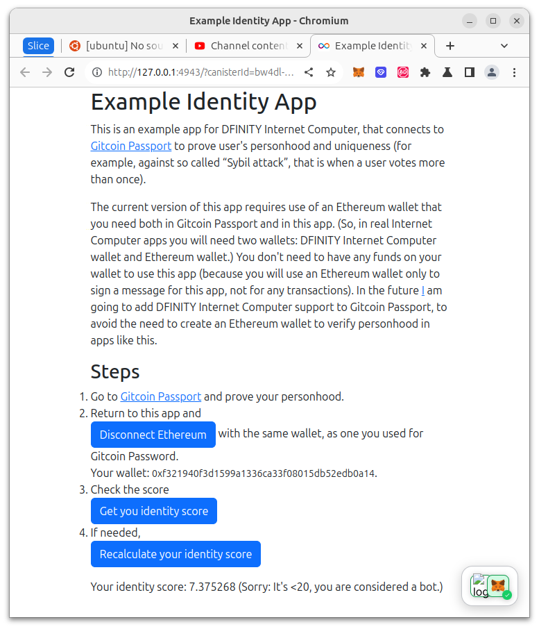

# DFINITY ICP Gitcoin Passport Client

This is an example app (template repository) for DFINITY Internet Computer, that connects to [Gitcoin Passport](https://passport.gitcoin.co/) to prove user's personhood and uniqueness (for example, against so called "Sybil attack", that is when a user votes more than once). The repository contains among other a Motoko library that similar apps are recommended to use.

It connects to Passport through an Ethereum signature and copies passport score into a DFINITY Internet Computer based app.
Copying the score is secure (provided that Gitcoin Passport is secure), that is the score is guaranteed to accurately
represent Gitcoin score for the user logged in in an Ethereum wallet, even in the case if the frontend is forged.

The current version of this app requires use of an Ethereum wallet that you need both in Gitcoin Passport and in this app. (So, in real Internet Computer apps you will need two wallets: DFINITY Internet Computer wallet and Ethereum wallet.) You don't need to have any funds on your wallet to use this app (because you will use an Ethereum wallet only to sign a message for this app, not for any transactions). In the future [I](https://portonvictor.org) am going to add DFINITY Internet Computer support to Gitcoin Passport, to avoid the need to create an Ethereum wallet to verify personhood in apps like this.



## Testing

Copy `Config.example.mo` files to `Config.mo` and edit it.

```
make
```

Running the app with `npm start` currently does not work as intended due to a bug.
But you can open the URL of `frontend` printed by `dfx deploy frontend` (called by `make`) to test the app on localhost.

You can also see how to use the app at https://youtu.be/J7WJZ2h6bzk